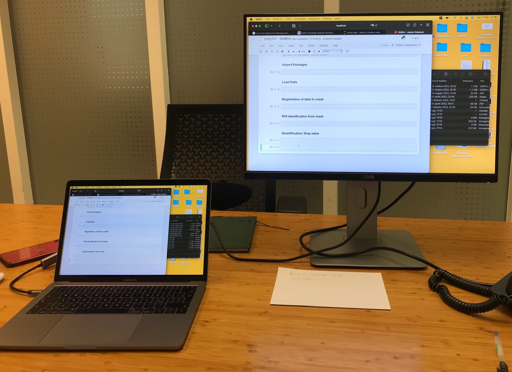

# Supervising-a-coding-project
Lessons learned

## Intro

This repository is meant to keep track of lessons learned while supervising a MsC student on a coding project. This is the first time that I'm resposible for the supervision of a project in which coding is the main activity (before it was mainly wetlab reasearch albeit with a good chunk of bioimage data analysis). The projects goals are vaguely determined. What we do know is that we want to:

- build image analysis pipelines
- use Python and Jupyter Notebooks as the main language[^1]
- write code that is useful for the analysis of **our** (fluorescence imaging) data
- write code that (in the end) can be used/run by users with little (no) coding experience

[^1]: Since the student has some background in coding in Python, and I started to code in Python roughly 6 months ago, we decided to use Python as the programming language. In the far future this seems a good choice as we may integrate our work with the Napari nD image viewer.

## Start material

- The student is taking Datacamp courses in Python to learn/refresh the basics.
- The next level is to go through this [Bioimage analysis tutorial](https://github.com/WhoIsJack/python-bioimage-analysis-tutorial)

Some background reading material:

- Ten simple rules for biologists learning to program: [https://doi.org/10.1371/journal.pcbi.1005871](https://doi.org/10.1371/journal.pcbi.1005871)
- Ten simple rules for writing and sharing computational analyses in Jupyter Notebooks: [https://doi.org/10.1371/journal.pcbi.1007007](https://doi.org/10.1371/journal.pcbi.1007007)

This collection of Python jupyter notebooks will be a great resource: [https://haesleinhuepf.github.io/BioImageAnalysisNotebooks/intro.html](https://haesleinhuepf.github.io/BioImageAnalysisNotebooks/intro.html)

Some nice tutorials/teaching materials as jupyter notebooks (the first in the list will be used for learning BioImage analsysis):

- [Python BioImage Analysis Tutorial](https://github.com/WhoIsJack/python-bioimage-analysis-tutorial)
- [NEUBIAS Academy @HOME: Interactive Bioimage Analysis with Python and Jupyter](https://github.com/guiwitz/neubias_academy_biapy)
- [Quick demo on image analysis using Python](https://github.com/CamachoDejay/teaching-bioimage-analysis-python/tree/main/quick_demo_220503)

## I'll save this for the future reading list:

- Ten simple rules for quick and dirty scientific programming: [https://doi.org/10.1371/journal.pcbi.1008549](https://doi.org/10.1371/journal.pcbi.1008549)
- Ten Simple Rules for Taking Advantage of Git and GitHub: [https://doi.org/10.1371/journal.pcbi.1004947](https://doi.org/10.1371/journal.pcbi.1004947)

## Ideas

Pair programming [https://martinfowler.com/articles/on-pair-programming.html](https://martinfowler.com/articles/on-pair-programming.html)

## Issues we run into:

How to start with Python? Well the first hurdle is to install Python. This online book chapter recognizesd this point and offers some background: [https://jni.github.io/using-python-for-science/intro-to-environments.html](https://jni.github.io/using-python-for-science/intro-to-environments.html)

I only installed Python once (maybe twice), so I tried a couple of things and then it worked. So this procedure was poorly documented. What worked when this was done together with the student (and maybe I missed some steps) for installation on a Macbook:

- Go to the miniconda webiste: [https://docs.conda.io/en/latest/miniconda.html](https://docs.conda.io/en/latest/miniconda.html)
- Download and install: `Miniconda3 macOS Intel x86 64-bit pkg`
- Open the Terminal
- Test the installation and run `conda env list`. If this returns conda environments, the installation was succesfull!

> The experts advise to install mamba, see e.g. [https://focalplane.biologists.com/2022/12/08/managing-scientific-python-environments-using-conda-mamba-and-friends/](https://focalplane.biologists.com/2022/12/08/managing-scientific-python-environments-using-conda-mamba-and-friends/) and [https://twitter.com/ZacSwider/status/1625834234874142724](https://twitter.com/ZacSwider/status/1625834234874142724)

## First steps

We started out discussing the 'workflow' detailing the steps (on paper) that were required to build a pipeline. We decided which steps were essential and which were 'nice to have'. I made a selection of what would be _relatively_ easy and what would be more complicated, so we could first focus on the simpler parts.
Next, we prepared a 'paired programming' setup, with a laptop to which we connected an external screen (which copies the screen of the laptop). It is probably more appropriate to call it supervised driving, where the student controls the wheel and the supervisor helps to solve issues (by hints, avoiding straight answers).

The student operates the laptop and the supervisor (or 'navigator') looks at the external screen. We started with a blank Jupyter notebook and we (=student) first wrote titles for the different sections with the different steps (load packages, load data, register data, find ROIs, quantify, save output).

The loading of packages is a pretty straightforward step that the student knew how to do, so that's nice to start with. Loading of data was also treated as a topic in a course, so that went pretty smoothly. We spend some time on different ways to check the loaded image data (dimensions, type, and also plotting it).

Since the nexty steps will be more complicated we visited the [scikit-image site](https://scikit-image.org/docs/stable/auto_examples/), which has very nice examples. We tried some of the code snippets, for instance the [mean filters](https://scikit-image.org/docs/stable/auto_examples/filters/plot_rank_mean.html). The next step we wanted to work on was segmentation and quantification of ROIs and there's much information in the [Python BioImage Analysis Tutorial](https://github.com/WhoIsJack/python-bioimage-analysis-tutorial), so we decided to first do this tutorial. We did the first part (up to '
Preprocessing') in paired programming (supervised driving) mode and that went well. The student was typing the code and this mode brought confidence. I could also encourage trying different things (like adding outcommenting code with # for troubleshooting). The disadvantage is that concentration on the topic/material was a bit less than when done individually. We agreed that the student would continue with the next section in unpaired (unsupoervised) mode.

It turns out that this material is quite challenging. I helped up to the part where thresholding was treated. After the section "Manual Thresholding & Threshold Detection" the material becomes (for our purpose) less relevant. So I wanted to jump to 'labeling' and quantification. So I pointed the student to these resources (with the idea to try these steps on our own images):

- Labeling objects:
https://haesleinhuepf.github.io/BioImageAnalysisNotebooks/20_image_segmentation/09_connected_component_labeling.html
- Feature extraction video: https://www.youtube.com/watch?v=dria4wCiaz0
- Quantification of labeled objects: https://haesleinhuepf.github.io/BioImageAnalysisNotebooks/22_feature_extraction/quantitative_measurements.html

